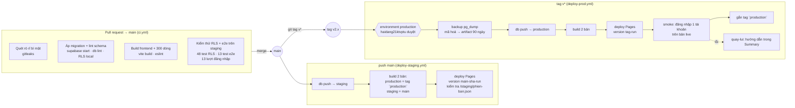

# Kiến trúc triển khai và pipeline CI/CD (GĐ6)

Tài liệu này mô tả cách mã đi từ PR tới production. Đặc tả nghiệp vụ ở `SPEC.md`; quy tắc phát hành ở `CLAUDE.md` (rule 4, 12).

## 1. Môi trường

| Môi trường | Supabase project | Frontend | Dữ liệu | Ai được ghi |
|---|---|---|---|---|
| Local | `supabase start` (Docker) | `npm run dev` | `supabase/seed.sql` | Dev |
| Staging | `vojmrjezspdftovzinek` (vptu-task-staging) | `https://haidang21ktvptu.github.io/vptu-mvp-task/staging/` | 7 tài khoản giả từ `seed.sql` (6 demo + `smoke_test`); test RLS/e2e tự tạo và tự dọn | `deploy-staging.yml` (push main); test trong CI |
| Production | `frwyxcmbonjaimziiuqr` (vptu-mvp-task) | `https://haidang21ktvptu.github.io/vptu-mvp-task/` | 48 tài khoản thật + `smoke_test` (is_system) | Chỉ `deploy-prod.yml` sau khi haidang21ktvptu duyệt |

Cả hai frontend nằm trong **một** artifact GitHub Pages (repo chỉ có một site) — xem mục 4.

## 2. Sơ đồ pipeline



Nguyên tắc cố định: **migration luôn chạy trước deploy frontend** trong cùng workflow (bài học GĐ1: frontend mới gọi hàm chưa có trong DB → toàn bộ cán bộ không đăng nhập được).

## 3. Từng workflow

### `ci.yml` — mọi pull request (và push main, trừ job staging)
| Job (tên check) | Làm gì |
|---|---|
| Quét rò rỉ bí mật | gitleaks toàn bộ lịch sử |
| Áp migration + lint schema | `supabase start` trên Postgres trắng (áp đủ migrations + `seed.sql`) + `supabase db lint --fail-on error` + **`tests/rls` với `RLS_LOCAL=1`** (kiểm tra RLS trên migration của chính PR, không tốn lượt đăng nhập hosted) |
| Build frontend + giới hạn 300 dòng | `vite build` với giá trị giả, ESLint, `scripts/check-line-limit.mjs` |
| Kiểm thử RLS + e2e trên staging | *Chỉ pull_request.* Một job: `tests/rls` (48 test, token thật của 6 tài khoản seed) rồi `tests/e2e` (Playwright, build Vite trỏ staging, 13 test ở 2 kích thước). Dọn dữ liệu bằng service_role **của staging** (secret). |

**Ngân sách đăng nhập** (Supabase Auth giới hạn 30 lượt/5 phút/IP): RLS 6 lượt (một tiến trình, `--test-isolation=none`) + e2e 7 lượt = **13 lượt/lần chạy**. e2e đạt 7 lượt nhờ `global-setup.mjs` đăng nhập A1/A2/A3 qua API (3 lượt) và ghi phiên thành storageState (`.auth/*.json`, khoá `sb-<ref>-auth-token` trong localStorage); project `desktop`/`mobile` mở trang với phiên sẵn; chỉ project `dang-nhap` (chạy sau cùng, vì đăng xuất huỷ phiên toàn cục) đăng nhập thật qua form (4 lượt). Job có `concurrency: kiem-thu-staging` nên hai PR không chạy chồng nhau; nếu vẫn gặp `over_request_rate_limit` (3 PR trong 5 phút, cùng IP runner) — chờ 5 phút rồi Re-run job. Cả hai bộ test từ chối chạy khi URL chứa ref production.

### `deploy-staging.yml` — push main
1. `supabase db push --project-ref <staging>` (dry-run trước, rồi `--yes`), ghi `migration list` vào Summary.
2. Build hai bản (composite action `.github/actions/build-pages-site`): **production** từ commit của tag `production` (commit phát hành gần nhất — chưa có tag thì lấy `main`, kèm cảnh báo), **staging** từ `main` với `BASE_PATH=/vptu-mvp-task/staging/` và anon key staging. Mỗi bản có `phien-ban.json` (`{moi_truong, phien_ban, commit, build_luc}`).
3. Deploy bằng composite `.github/actions/deploy-pages-versioned` với `pages_build_version = main-<sha>-<run_id>-<run_attempt>`, rồi curl `/staging/phien-ban.json` tới khi thấy đúng commit (tối đa 3 phút).

**Vì sao không dùng `actions/deploy-pages`:** action đó luôn gửi `pages_build_version = GITHUB_SHA` (không có input đổi; `GITHUB_*` không ghi đè được bằng `env:`). GitHub Pages dùng `pages_build_version` làm khoá idempotent — POST lại cùng version thì trả deployment cũ và **không thay artifact**. Mọi tag `v*` đều trỏ vào commit mà deploy-staging đã xuất bản với đúng SHA đó, nên phát hành `v2.0.0-rc1` bị bỏ qua (job deploy "xanh" sau 5 giây, bản live vẫn `main@…`). Composite gọi thẳng REST `POST /repos/{r}/pages/deployments` (`artifact_id` từ output của `upload-pages-artifact`, OIDC token lấy như `core.getIDToken()` không audience), poll `GET …/deployments/{id}` tới `succeed` (≤ 10 phút, quá thì `cancel`), và ghi `pages_build_version` + `deployment_id` vào Summary của job để tra cứu sự cố không cần mở log. Job deploy vẫn ở environment `github-pages` với `pages: write` + `id-token: write` khai báo ở cấp job.

### `deploy-prod.yml` — tag `v*`
| Job | Nội dung |
|---|---|
| `phat-hanh` (environment **production**) | **Dừng chờ duyệt** (required reviewer haidang21ktvptu). Sau khi duyệt: `supabase db dump` schema + data → `tar` + `gpg --symmetric AES-256` bằng `BACKUP_PASSPHRASE` → artifact `prod-<ngày>-<tag>.tar.gz.gpg` (90 ngày; phải mã hoá vì artifact của repo public tải được công khai) → `db push --dry-run` (vào Summary) → `db push --yes` → build hai bản (production = tag, staging = main). |
| `deploy` (environment github-pages) | `deploy-pages-versioned` với `pages_build_version = <tag>-<run_id>-<run_attempt>` (duy nhất dù tag trỏ vào commit đã deploy từ main); Summary ghi version + deployment_id. |
| `smoke` | Đợi `phien-ban.json` bản live ghi đúng tag (≤ 3 phút) → Playwright `tests/e2e/smoke/` đăng nhập tài khoản hệ thống `smoke_test` (`SMOKE_USERNAME/PASSWORD`), vào app, không lỗi console, đăng xuất → **gắn tag `production`** vào commit vừa phát hành. Tài khoản này là A3 thật về quyền (RLS không đổi) nhưng `is_system = true` nên frontend không hiện ở danh bạ/cây/KPI; trên staging do `seed.sql` tạo (mật khẩu `123456`), trên production do script tạo với mật khẩu ngẫu nhiên. |
| `quay-lui` (chỉ khi lỗi) | Ghi hướng dẫn quay lui vào Summary theo bước bị lỗi (mục 6). |

Cấu hình Auth (`supabase config push`) **không** nằm trong pipeline — vẫn làm tay sau khi trình `config diff` (quy tắc phát hành hiện hành).

## 4. Vì sao staging frontend nằm ở `/staging/` cùng artifact

GitHub Pages chỉ phục vụ **một** site cho mỗi repo và mỗi lần deploy thay toàn bộ site, nên mọi lần deploy đều phải đẩy đủ cả hai bản. Composite action build **cả hai** ở mọi workflow; bản production được build lại từ commit của tag `production` (không phải `main`) nên push main không làm đổi production.

| Phương án | Ưu | Nhược |
|---|---|---|
| **A. `/staging/` cùng artifact (đã chọn)** | Không thêm repo, secret hay dịch vụ; một URL quen thuộc; cùng workflow Pages đã dùng | Mỗi push main build lại bản production (từ tag, không từ main — build Vite tất định nên kết quả như cũ); hai workflow phải xếp hàng chung (`concurrency: pages`) — trong lúc tag v* chờ duyệt, deploy staging chờ theo, nên **duyệt hoặc từ chối sớm**; staging công khai trên Internet (dữ liệu giả, tài khoản `demo_*` đã công khai trong repo) |
| B. Repo riêng `vptu-mvp-task-staging` (push `dist` bằng deploy key) | Tách hẳn, push main không đụng artifact production | Thêm repo + deploy key/PAT (secret có quyền ghi repo khác), base path khác, hai nơi cấu hình Pages |
| C. Dịch vụ khác (Cloudflare Pages/Netlify) cho staging | Preview theo từng PR, không đụng Pages | Thêm nhà cung cấp, tài khoản, token; ngoài stack đã chốt trong SPEC |

Nếu sau này cần preview theo PR, chuyển sang B hoặc C; hiện tại A đủ cho một người bảo trì.

## 5. Secrets và cấu hình GitHub cần tạo (chủ dự án tự nhập)

**Repository secrets** (Settings → Secrets and variables → Actions → Repository secrets):

| Tên | Lấy ở đâu | Dùng ở |
|---|---|---|
| `SUPABASE_ACCESS_TOKEN` | supabase.com → Account → Access Tokens → Generate new token (token cá nhân, dùng được cả hai project) | deploy-staging, deploy-prod (CLI `db push`, `db dump`) |
| `STAGING_DB_PASSWORD` | Dashboard staging → Project Settings → Database → Database password (Reset nếu không nhớ) | deploy-staging |
| `STAGING_SUPABASE_ANON_KEY` | Dashboard staging → Project Settings → API Keys → `anon` (hoặc `supabase projects api-keys --project-ref vojmrjezspdftovzinek`) | ci (e2e), build bản staging |
| `STAGING_SUPABASE_SERVICE_ROLE_KEY` | cùng trang, `service_role` — **chỉ staging**, dùng dọn dữ liệu test | ci |
| `VITE_SUPABASE_URL`, `VITE_SUPABASE_ANON_KEY` | *đã có* (production, chỉ anon key) | build bản production (ở cả hai workflow deploy) |
| `SMOKE_USERNAME`, `SMOKE_PASSWORD` | `smoke_test` — tài khoản hệ thống (`accounts.is_system = true`, A3, phòng CDS_CY, ẩn khỏi mọi danh sách cán bộ) tạo bằng `scripts/create-system-account.mjs --project-ref <ref>`; script in mật khẩu ngẫu nhiên đúng một lần | deploy-prod job smoke |

**Environment `production`** (Settings → Environments → New environment): Required reviewers = `haidang21ktvptu`; Deployment branches and tags → *Selected* → thêm tag pattern `v*`. Secrets của environment:

| Tên | Lấy ở đâu |
|---|---|
| `PROD_DB_PASSWORD` | Dashboard production → Project Settings → Database |
| `BACKUP_PASSPHRASE` | Tự sinh, ví dụ `openssl rand -base64 32`; **lưu vào trình quản lý mật khẩu** — không có nó không giải mã được backup |

**Environment `github-pages`** (đã có, đang chỉ cho nhánh `main`): Deployment branches and tags → thêm tag pattern `v*` để `deploy-prod` được phép deploy từ tag.

**Ruleset `main`** (Settings → Rules → main → Require status checks): thêm check **`Kiểm thử RLS + e2e trên staging`** bên cạnh 3 check hiện có (`Quét rò rỉ bí mật`, `Áp migration + lint schema`, `Build frontend + giới hạn 300 dòng`).

`SMOKE_*` để ở repository (không phải environment) vì job smoke chạy *sau* job deploy; nếu đặt trong environment production thì GitHub yêu cầu duyệt lần thứ hai trước smoke (chủ dự án chấp nhận, 2026-09-14). Tài khoản `smoke_test` chỉ là A3 không có nhiệm vụ nào — lộ mật khẩu chỉ cho phép đăng nhập xem màn hình trống.

## 6. Quay lui

- **Nguyên tắc:** production luôn là một tag `v*`; tag `production` (di động) đánh dấu commit đang chạy. Quay lui frontend = **gắn tag `v*` mới cao hơn trỏ vào commit cũ** (`git tag v2.0.2 production && git push origin v2.0.2`) → deploy-prod chạy lại, chờ duyệt; migration không áp gì thêm. Không xoá/đổi tag cũ.
- **Lỗi trước `db push`** (backup, secrets): production chưa đổi gì.
- **Lỗi ở `db push`:** `supabase migration list --project-ref frwyxcmbonjaimziiuqr` xem migration nào đã áp; ưu tiên sửa tiến bằng migration mới; chỉ khôi phục từ backup khi không sửa tiến được.
- **Lỗi ở deploy:** DB đã mới, frontend cũ — Re-run failed jobs (mỗi lần chạy lại có version mới nên deploy thật, không bị Pages bỏ qua).
- **Smoke lỗi:** frontend mới đã lên — quay lui frontend như trên; nếu do migration, khôi phục DB.
- **Khôi phục từ backup:** tải artifact `prod-<ngày>-<tag>.tar.gz.gpg` → `gpg -d --batch --pinentry-mode loopback --passphrase "<BACKUP_PASSPHRASE>" file.tar.gz.gpg | tar xz` → `schema.sql` + `data.sql` (có `auth.users`, `auth.identities`) → chạy `scripts/restore-db.sh` (GĐ7). Dữ liệu ghi sau lúc backup sẽ mất.

## 7. Cách phát hành một phiên bản

```
git checkout main && git pull
git tag v2.0.0-rc1 && git push origin v2.0.0-rc1     # → deploy-prod dừng ở "Review deployments"
```
Vào Actions → run của tag → *Review deployments* → duyệt. Theo dõi Summary (danh sách migration, backup, kết quả smoke). Bản live: `https://haidang21ktvptu.github.io/vptu-mvp-task/phien-ban.json` ghi tag vừa phát hành.
